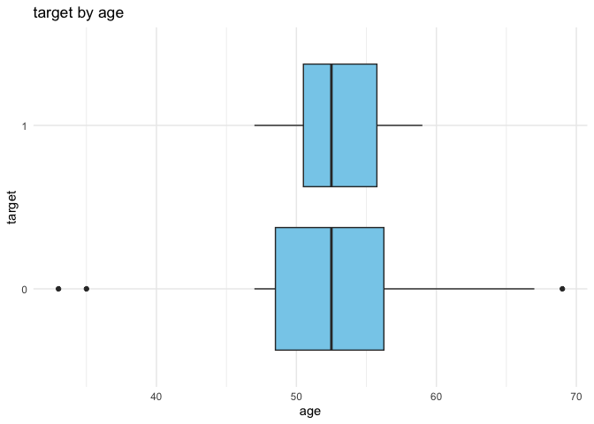

# HeartR package

## Description

**HeartR** is an R package designed for educational purposes to explore,
summarise and simulate heart disease related data. Informative plots may
be created to further analyse the distribution of variables and
correlation between features. The package provides several functions and
one S3 method:

1.  `plot_heart`: a function that provides multiple visualisation
    options
2.  `simulation`: for generating a synthetic heart disease dataset.
    However it may be used for other datasets with binary outcomes
3.  `summ_heartr`: for creating a list of summary statistics that will
    be used further in the `print.summ_heartr` method
4.  An S3 `print.summ_heartr` method: for providing an appealing
     customisable table for the output of the summ_heartr function.
5.  `summ_heartrplot`: for generating interactive plots of summary
    statistics that was gotten from `print.summ_heartr`.

## Installation

You can install the development version of HeartR from
[GitHub](https://github.com/) with:

``` r
# install.packages("pak")
pak::pak("faridat45/HeartR")
```

## Example

This is a basic example which shows you how to generate synthetic data,
adjusting the categorical and numeric variables included and number of
observations:

``` r
library(HeartR)

sim_data <- simulation(
  data = heart_dat,
  n = 20,
  contVars = c("age", "cholesterol","restingBP"),
  catVars = c("sex","chestPT","exerAngina")
)
utils::head(sim_data)
#>   age cholesterol restingBP sex chestPT exerAngina target
#> 1  67         254       146   0       2          0      0
#> 2  49         290       128   0       4          0      0
#> 3  49         304       165   1       2          0      0
#> 4  59         213       135   1       4          0      1
#> 5  56         314       135   0       3          0      0
#> 6  53         181       136   1       4          1      1
```

From this dataset, plots can be generated using the `plot_heart`
function:



A more detailed introduction is provided in the heartR vignette
